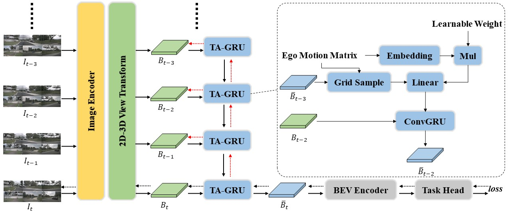
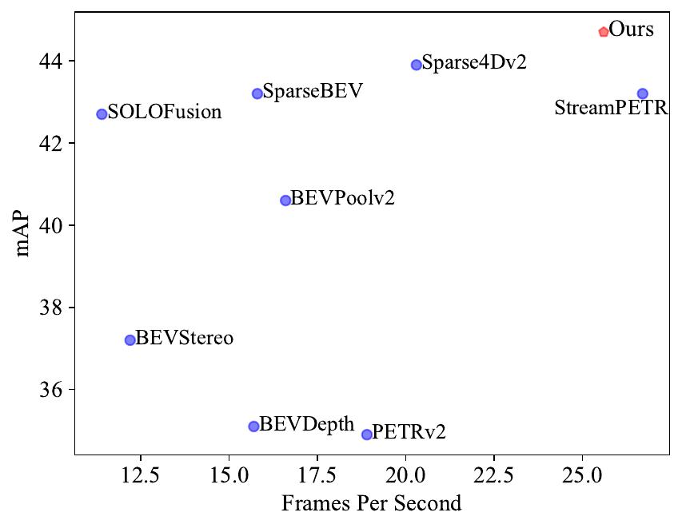

<h1>RecurrentBEV</h1>
<h3>[ECCV 2024] RecurrentBEV: A Long-term Temporal Fusion Framework for Multi-view 3D Detection</h3>

  

 

## Introduction

This repository is an official implementation of RecurrentBEV. It is built based on MMDetection3D.

## Main Results

#### NuScenes Val Set

| Backbone | Img Size | Pretrain                                                                                                                                                                                  | NDS  | mAP  | Config                                                                       | Download                                                                                    |
|:--------:|:--------:|:-----------------------------------------------------------------------------------------------------------------------------------------------------------------------------------------:|:----:|:----:|:----------------------------------------------------------------------------:|:-------------------------------------------------------------------------------------------:|
| Res50    | 256x704  | [ImageNet](https://download.pytorch.org/models/resnet50-0676ba61.pth)                                                                                                                     | 54.9 | 44.5 | [config](configs/recurrentbev/recurrentbev_res50_704x256_ep90.py)            | [model](https://drive.google.com/file/d/1khQVn0dAZQAKzXGcYLdAaJXlnOaeZpES/view?usp=sharing) |
| Res101   | 512x1408 | [ImageNet](https://download.pytorch.org/models/resnet50-0676ba61.pth)                                                                                                                     | 59.9 | 50.9 | [config](configs/recurrentbev/recurrentbev_res101_1408x512_ep90.py)          | -                                                                                           |
| Res101   | 512x1408 | [NuImages](https://download.openmmlab.com/mmdetection3d/v0.1.0_models/nuimages_semseg/cascade_mask_rcnn_r101_fpn_1x_nuim/cascade_mask_rcnn_r101_fpn_1x_nuim_20201024_134804-45215b1e.pth) | 61.2 | 52.8 | [config](configs/recurrentbev/recurrentbev_res101_1408x512_ep60_nuimages.py) | [model](https://drive.google.com/file/d/1Op8nBCWZD9kj-b_6ebK5X8S6M0JyAbFG/view?usp=sharing) |

#### NuScenes Test Set

| Backbone   | Img Size | Pretrain                                                                             | NDS  | mAP  | Config                                                                                | Download                                                                                    |
|:----------:|:--------:|:------------------------------------------------------------------------------------:|:----:|:----:|:-------------------------------------------------------------------------------------:|:-------------------------------------------------------------------------------------------:|
| V2-99      | 640x1600 | [DD3D](https://github.com/exiawsh/storage/releases/download/v1.0/dd3d_det_final.pth) | 65.1 | 57.3 | [config](configs/recurrentbev/recurrentbev_v2-99_1600x640_ep60_trainval.py)           | [model](https://drive.google.com/file/d/18TZJ_l928F_2GfXNtWckDnQqoBy8Fg9x/view?usp=sharing) |
| ConvNeXt-B | 640x1600 | COCO                                                                                 | 65.1 | 57.4 | [config](configs/recurrentbev/recurrentbev_convnext-b_1600x640_ep60_trainval_coco.py) | -                                                                                           |

#### Inference Speed

The below table shows  end-to-end FPS (Frames Per Second) of RecurrentBEV measured with a single RTX-3090.

| Method                                                                                                                             | Pytorch-FP32 | TensorRT-FP32 | TensorRT-FP16 | TensorRT-INT8 |
|:----------------------------------------------------------------------------------------------------------------------------------:|:------------:|:-------------:|:-------------:|:-------------:|
| RecurrentBEV                                                                                                                       | 25.6         | 46.3          | 129.3         | **234.8**     |
| [StreamPETR](https://github.com/exiawsh/StreamPETR/blob/main/projects/configs/StreamPETR/stream_petr_r50_flash_704_bs2_seq_90e.py) | 26.7         | 53.9          | 134.6         | 167.4         |

## Getting Started

Please follow our documentation step by step. If you like our work, please recommend it to your colleagues and friends.

1. [Environment Setup.](docs/data_preparation.md)

2. [Data Preparation.](docs/data_preparation.md)

3. [Training and Inference.](docs/training_and_inference.md)

4. [Visualization](docs/visualization.md).

5. [Deployment](docs/deployment.md).

## Features List

- [x] RecurretBEV code
- [ ] Visualization
- [ ] Convert to TRT model
- [ ] TensorRT inference

## Acknowledgements

We thank these great works and open-source codebases:

* [MMDetection3D](https://github.com/open-mmlab/mmdetection3d)

* [BEVDet](https://github.com/HuangJunJie2017/BEVDet)

* [SOLOFusion](https://github.com/Divadi/SOLOFusion)

* [StreamPETR](https://github.com/exiawsh/StreamPETR/tree/main?tab=readme-ov-file)

## Citation

If you find RecurrentBEV is useful in your research or applications, please consider giving us a star 🌟 and citing it by the following BibTeX entry.
